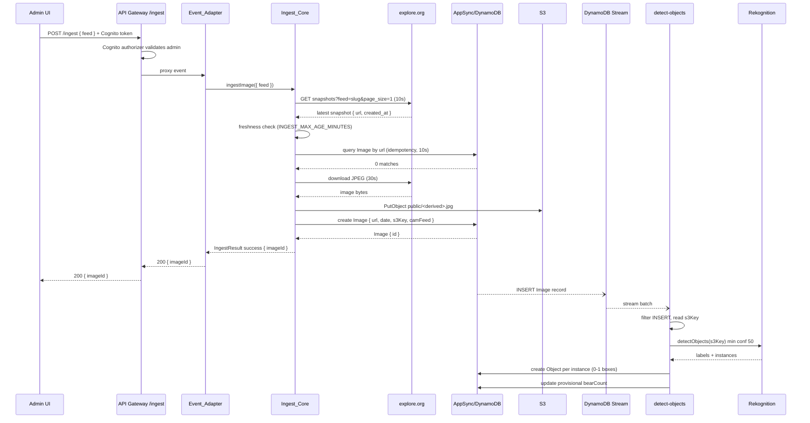

# Design Document: image-ingestion

## Overview

The `image-ingestion` feature is the backend + admin-UI pipeline that moves a webcam snapshot from the explore.org snapshot API into BearCam Companion v2 and runs AI object detection on each new image. It is built on the Amplify Gen 2 TypeScript/CDK-first model (per `stack.md` and `backend.md`).

The feature is composed of four cooperating pieces:

1. **`ingest-image` Lambda** — fetches a snapshot (latest for a feed, or a specific URL), applies a freshness check and an idempotency check, downloads the JPEG, uploads it to S3 under `public/`, and creates an `Image` record in AppSync. (Requirements 1–5)
2. **API Gateway REST endpoint `POST /ingest`** — a single endpoint with dual authorization (Cognito admin + API key/usage plan), declared as a CDK construct in `amplify/backend.ts`. (Requirements 6, 7)
3. **`detect-objects` Lambda** — triggered by DynamoDB Streams on `INSERT` to the `Image` table, runs Rekognition `detectLabels`, stores every detection that has bounding-box instances as `Object` records (no label filtering), and sets a provisional `Image.bearCount`. (Requirements 8–11)
4. **Admin ingestion page** — an admin-only App Router page that triggers ingestion by calling `POST /ingest` with the admin's Cognito token, offering a "fetch latest for feed" action and a browse-and-select flow. (Requirements 12, 13)

Two cross-cutting concerns bind these together:

- **Shared constants module** (`src/lib/constants.ts`) — the single source of truth for `CAM_FEEDS` and the explore.org endpoint, Lambda-safe (no browser deps). (Requirement 14)
- **Explore.org resilience** — all calls to the undocumented, fragile explore.org API are defensively wrapped, validated, and converted to structured results, never unhandled throws. (Requirement 15)

### Design Principles

- **Invocation-agnostic core.** The ingestion business logic is a pure function `ingestImage({ feed, url?, date? })` that never reads a raw event. A thin `Event_Adapter` translates the API Gateway proxy event into that normalized input. This is what lets EventBridge scheduling drive the same logic later with zero changes to the core. (Requirement 5)
- **Swappable detection backend.** The detection call is isolated behind `detectObjects(s3Key): Promise<DetectionResult[]>`. Replacing Rekognition with a bear-specific model later means rewriting only that function; the handler consumes only the `DetectionResult` contract. (Requirement 11)
- **Result-as-value, never throw.** Both cores return discriminated-union result values so every outcome (success / skip / failure) is distinguishable and mappable to an HTTP status without exception handling at the boundary. (Requirements 5.6–5.8, 15.1)
- **Lambda-managed denormalized fields.** `detect-objects` sets a *provisional* `bearCount` only. It never writes `bearList` or any `Object` consensus field — those remain owned by `compute-bear-list`. (Requirement 10.2, `data-model.md`)

### Out of Scope (with room left for it)

- **EventBridge scheduling** — not built here. The invocation-agnostic `Ingest_Core` plus a new `Event_Adapter` branch is all that a future scheduled rule needs; no core change required. (Requirement 5, `project.md`)
- **`compute-bear-list` Lambda** — owned by the bear-identification spec. The `bearCount` written by `detect-objects` is explicitly provisional and will be recomputed from consensus later. `detect-objects` deliberately leaves `bearList`, `consensusName`, `consensusConfidence`, and `totalVotes` untouched so the later Lambda is the single source of truth. (`backend.md`, `data-model.md`)

---

## Architecture

### End-to-End Flow

```mermaid
flowchart TD
    subgraph Clients
        A[Admin UI<br/>App Router /admin/ingest]
        X[External caller]
    end

    subgraph APIGW[API Gateway REST API]
        R[POST /ingest]
        AUTHZ1[Cognito User Pool authorizer<br/>admin group]
        AUTHZ2[API key + Usage Plan<br/>rate / burst / quota]
    end

    subgraph IngestLambda[ingest-image Lambda]
        EA[Event_Adapter<br/>parses proxy event]
        IC[Ingest_Core<br/>ingestImage]
    end

    EXPLORE[(explore.org<br/>snapshot API)]
    S3[(S3 bucket<br/>public/ prefix)]
    APPSYNC[(AppSync GraphQL<br/>+ DynamoDB)]

    subgraph DetectLambda[detect-objects Lambda]
        DA[Stream adapter<br/>filter INSERT]
        DC[detectObjects s3Key]
    end

    REKOG[(Amazon Rekognition<br/>detectLabels)]

    A -->|Cognito token| R
    X -->|x-api-key| R
    R --> AUTHZ1
    R --> AUTHZ2
    AUTHZ1 --> EA
    AUTHZ2 --> EA
    EA --> IC
    IC -->|fetch latest / specific| EXPLORE
    IC -->|idempotency query| APPSYNC
    IC -->|PutObject| S3
    IC -->|create Image| APPSYNC
    IC -->|IngestResult| EA
    EA -->|HTTP status + JSON| R

    APPSYNC -. DynamoDB Stream INSERT on Image .-> DA
    DA --> DC
    DC -->|detect| REKOG
    DC -->|DetectionResult&#91;&#93;| DA
    DA -->|create Object records| APPSYNC
    DA -->|update provisional bearCount| APPSYNC

    APPSYNC -. "future: compute-bear-list (out of scope)" .-> APPSYNC
```



### Sequence: happy-path ingestion + detection



### Component Responsibilities and Boundaries

| Component | Location | Responsibility | Must NOT |
|-----------|----------|----------------|----------|
| `Event_Adapter` | `amplify/functions/ingest-image/handler.ts` | Parse raw API Gateway proxy event → normalized input; map `IngestResult` → HTTP response | Contain business logic |
| `Ingest_Core` | `amplify/functions/ingest-image/ingest-core.ts` | All ingestion logic as `ingestImage(input)` | Read any raw event shape |
| API Gateway construct | `amplify/backend.ts` | REST API, route, dual authorizers, usage plan, CORS | Contain Lambda logic |
| `detect-objects` handler | `amplify/functions/detect-objects/handler.ts` | Stream parsing, INSERT filter, Object creation, provisional bearCount | Call Rekognition directly |
| `detectObjects` | `amplify/functions/detect-objects/detect-core.ts` | Isolated detection call returning `DetectionResult[]` | Leak Rekognition-specific shapes |
| Shared constants | `src/lib/constants.ts` | `CAM_FEEDS`, explore.org endpoint, `CamFeed` type | Import `next/*`, React, browser globals |
| Admin page | `src/app/admin/ingest/page.tsx` + client component | Feed selection, trigger ingestion, browse flow | Call API client directly (goes through helper) |
| Ingest helper | `src/lib/amplify/ingest.ts` | Typed `POST /ingest` client attaching Cognito token | Be called from a non-admin context without gating |

The architecture reuses what `project-setup` already produced: the data schema (`amplify/data/resource.ts`), the storage bucket (`amplify/storage/resource.ts`), the shared `CAM_FEEDS` constant (`src/lib/constants.ts`), the `isAdmin()` helper (`src/lib/amplify/auth.ts`), and the Amplify client (`src/lib/amplify/client.ts`).

---

## Components and Interfaces

### 1. `ingest-image` Lambda

#### File layout

```
amplify/functions/ingest-image/
├── resource.ts          # defineFunction (Node.js 20.x, env vars, timeout)
├── handler.ts           # Event_Adapter: proxy-event parse + IngestResult→HTTP
├── ingest-core.ts       # Ingest_Core: ingestImage() pure business logic
├── explore-client.ts    # explore.org fetch + response validation (type guards)
├── appsync-client.ts    # IAM-authorized GraphQL (idempotency query + create Image)
├── s3-client.ts         # SDK v3 PutObject + S3 key derivation
└── types.ts             # IngestInput, IngestResult discriminated union
```

Business logic lives in `ingest-core.ts` and the three client modules it calls. `handler.ts` is the only module that imports or reads the API Gateway event shape (Requirement 5.3).

#### Normalized input

```typescript
// amplify/functions/ingest-image/types.ts
import type { CamFeed } from '../../../src/lib/constants';

export type IngestInput = {
  feed: CamFeed;        // validated by the adapter before Ingest_Core is called
  url?: string;         // optional specific snapshot URL (absolute HTTP(S))
  date?: string;        // optional ISO 8601 datetime override
};
```

#### `IngestResult` — discriminated union (Requirements 5.6, 5.7)

A single `kind` discriminator distinguishes every outcome without inspecting other fields. The adapter maps `kind` → HTTP status.

```typescript
// amplify/functions/ingest-image/types.ts

export type IngestSuccess = {
  kind: 'success';
  imageId: string;      // new Image id (Req 4.10)
  s3Key: string;
};

export type SkipReason =
  | 'no-snapshot'            // explore.org returned zero snapshots (Req 1.8)
  | 'image-too-old'         // failed freshness check (Req 2.3)
  | 'invalid-timestamp'     // created_at missing/unparseable (Req 2.5)
  | 'already-exists';       // idempotency match (Req 3.2, 3.4)

export type IngestSkip = {
  kind: 'skip';
  reason: SkipReason;
  message: string;          // human-readable (Req 15.6, 12.9)
  existingImageId?: string; // present when reason === 'already-exists' (Req 3.2)
};

export type UpstreamSource = 'explore-api' | 'explore-download' | 's3';

export type IngestUpstreamFailure = {
  kind: 'upstream-failure';
  source: UpstreamSource;   // identifies explore.org vs download vs S3 (Req 1.6, 1.7, 4.2, 4.5)
  detail:
    | 'request-failed'
    | 'non-success-status'
    | 'timeout'
    | 'malformed-response'  // Req 1.9, 15.3
    | 'empty-or-non-jpeg';  // Req 4.3
  message: string;
  field?: string;           // missing/invalid field for malformed-response (Req 15.3)
};

export type InternalReason =
  | 'idempotency-check-failed'   // Req 3.5
  | 'image-create-failed'        // Req 4.9 (stored but not recorded)
  | 'date-validation-failed'     // Req 4.8
  | 'unexpected';                // Req 5.8 catch-all

export type IngestInternalFailure = {
  kind: 'internal-failure';
  reason: InternalReason;
  message: string;
  s3Key?: string;           // present for 'image-create-failed' (stored-not-recorded, Req 4.9)
};

// Client input errors are produced by the ADAPTER before Ingest_Core runs
// (Req 1.3, 1.4, 5.4, 5.5). Represented as a distinct kind so the adapter can
// return it uniformly, but it is never returned *by* Ingest_Core.
export type IngestClientError = {
  kind: 'client-error';
  field: 'feed' | 'url' | 'date' | 'body';
  message: string;
};

export type IngestResult =
  | IngestSuccess
  | IngestSkip
  | IngestUpstreamFailure
  | IngestInternalFailure;

// The adapter-level union additionally includes client-error.
export type IngestOutcome = IngestResult | IngestClientError;
```

> Note on Requirement 5.7: it enumerates "success, skip, upstream-failure, internal-failure" as the outcomes of `Ingest_Core`. `client-error` is produced by the `Event_Adapter` *before* `Ingest_Core` is invoked (Req 5.4, 5.5, 6.6), so it is intentionally outside the `IngestResult` returned by the core and lives in the adapter-level `IngestOutcome`.

#### `Ingest_Core` signature and pipeline (Requirements 1–4)

```typescript
// amplify/functions/ingest-image/ingest-core.ts
export async function ingestImage(input: IngestInput): Promise<IngestResult>;
```

Pipeline stages, in order. Each stage can short-circuit by returning an `IngestResult`:

1. **Resolve feed slug.** Look up `CAM_FEEDS[input.feed]`. Feed validity is already guaranteed by the adapter (Req 5.4), but the core still resolves exclusively via `CAM_FEEDS` and embeds no slug literal (Req 1.5, 14.4).
2. **Determine snapshot source.**
   - If `input.url` present → treat as a specific snapshot (adapter already validated it is a non-empty string; the core re-validates it is an absolute HTTP(S) URL, Req 1.2, 1.4). The core still fetches the explore.org listing to obtain `created_at` metadata for that snapshot, or treats the provided `date`/listing match as the timestamp source (see step 4).
   - Else → request the latest: `GET {ENDPOINT}?feed=<slug>&order=desc&orderBy=created_at&page=1&page_size=1` (Req 1.1).
3. **Fetch + validate explore.org response** via `explore-client.ts` (10s timeout, Req 1.6). Convert connection failure / non-2xx / unparseable body into `upstream-failure` (Req 1.7, 15.1). Validate required fields (`url`, `created_at`) with type guards; missing/wrong type → `upstream-failure` + `detail: 'malformed-response'` naming the field (Req 1.9, 15.2, 15.3). Zero snapshots → `skip` + `reason: 'no-snapshot'` (Req 1.8).
4. **Resolve the effective date.** If `input.date` provided, use it (Req 4.7); else use snapshot `created_at`. If neither yields a parseable timestamp → for the freshness stage this is `skip` + `invalid-timestamp` (Req 2.5); when a `date` input was absent and `created_at` is unparseable at record time → `internal-failure`/validation (Req 4.8). (See Error Handling for the precise ordering.)
5. **Freshness check** (Req 2). Read `INGEST_MAX_AGE_MINUTES`, parse base-10; if unset/empty/`< 1`/non-integer → default 10 (Req 2.1, 2.2). `ageMs = Date.now() - created_at_ms`; if `ageMs > minutes * 60000` → `skip` + `image-too-old` (Req 2.3). Else proceed (Req 2.4).
6. **Idempotency check** (Req 3). Query AppSync for an `Image` whose `url` exactly (case-sensitive) matches the snapshot URL, *before* any download/upload (Req 3.1). 10s timeout or error → `internal-failure` + `idempotency-check-failed` (Req 3.5). ≥1 match → `skip` + `already-exists` with the first matched id (Req 3.2, 3.4). Zero matches → proceed (Req 3.3).
7. **Download JPEG** (Req 4.1–4.3). Fetch bytes within 30s; failure/timeout/non-2xx → `upstream-failure` source `explore-download` (Req 4.2). Zero bytes or not a JPEG → `upstream-failure` + `empty-or-non-jpeg` (Req 4.3). JPEG is validated by magic bytes `FF D8 FF`.
8. **Upload to S3** (Req 4.4, 4.5). `PutObject` to `public/<derived>.jpg` where the key is deterministically derived from the snapshot URL so the same snapshot resolves to the same key (Req 4.4). Failure → `upstream-failure` source `s3` (Req 4.5).
9. **Create Image record** (Req 4.6–4.10). Create via AppSync with `{ url, date, s3Key, camFeed }`. Failure after successful upload → `internal-failure` + `image-create-failed` carrying `s3Key` (stored-but-not-recorded, Req 4.9). Success → `success` with the new `imageId` (Req 4.10).

#### S3 key derivation (Req 4.4)

The key must be deterministic per snapshot URL (so re-ingest resolves to the same key) and begin with `public/`. Strategy: `public/<sha256(url) hex>.jpg`. This is collision-resistant and stable, independent of the explore.org filename format. The idempotency check (step 6) is the primary duplicate guard; the deterministic key is a defense-in-depth so a re-run overwrites rather than duplicates in S3.

#### AppSync access from Lambda (IAM-authorized GraphQL)

The Lambda is **not** an Amplify-generated resolver; it is a standalone function that calls the AppSync GraphQL endpoint using **IAM (SigV4) authorization** with its execution-role credentials. The data API's default mode is `apiKey`, so the function's IAM role must be granted `appsync:GraphQL` on the Image type, and the schema must permit IAM access for the operations the Lambda performs (idempotency `list`/`get` and `create`). This is wired in `amplify/backend.ts` by adding the function to the data stack's authorization and granting the role (see API Gateway section). The client module signs requests with `@aws-sdk/signature-v4` + `@aws-crypto/sha256-js` (or `aws4fetch`), posting GraphQL over `fetch` to `AMPLIFY_DATA_GRAPHQL_ENDPOINT`.

> Design note: an alternative is to attach the Lambda as a `defineFunction` with a generated data client (`generateClient` configured with `iam` auth and `AMPLIFY_DATA_GRAPHQL_ENDPOINT`). Either is acceptable; the contract that matters to this design is "IAM-authorized GraphQL from the Lambda execution role," isolated inside `appsync-client.ts`.

#### S3 access from Lambda (SDK v3)

`s3-client.ts` uses `@aws-sdk/client-s3` `PutObjectCommand` with `Bucket = AMPLIFY_STORAGE_BUCKET_NAME`, `Key = public/<derived>.jpg`, `ContentType = 'image/jpeg'`. The function's execution role is granted `s3:PutObject` on `arn:…:<bucket>/public/*` in `backend.ts`.

#### Environment variables (Req 2.1, `backend.md`)

| Var | Source | Use |
|-----|--------|-----|
| `AMPLIFY_DATA_GRAPHQL_ENDPOINT` | injected by Amplify Gen 2 | AppSync endpoint for idempotency query + create |
| `AMPLIFY_STORAGE_BUCKET_NAME` | injected by Amplify Gen 2 | S3 bucket for upload |
| `INGEST_MAX_AGE_MINUTES` | configured, default `10` | Freshness threshold (Req 2.1, 2.2) |

#### Timeouts (Req 1.6, 3.5, 4.1)

Enforced per-operation with `AbortController` + `setTimeout`, not relying on the Lambda's overall timeout:

| Operation | Timeout | On exceed |
|-----------|---------|-----------|
| explore.org listing fetch | 10s | `upstream-failure` source `explore-api`, `detail: 'timeout'` (Req 1.6) |
| JPEG download | 30s | `upstream-failure` source `explore-download` (Req 4.2) |
| AppSync idempotency query | 10s | `internal-failure` `idempotency-check-failed` (Req 3.5) |

The Lambda's configured timeout (`resource.ts`) is set above the sum of worst-case stage timeouts (e.g. 60s) so the per-stage `AbortController` always fires first and produces a structured result rather than a hard Lambda timeout.

---

### 2. API Gateway REST endpoint

#### CDK construct via the Amplify Gen 2 escape hatch (Req 6.1)

Amplify Gen 2 exposes the underlying CDK stack through `backend.createStack()` and resource `.resources` handles. The REST API is declared in `amplify/backend.ts`:

```typescript
// amplify/backend.ts (additions, illustrative)
import { defineBackend } from '@aws-amplify/backend';
import {
  RestApi, LambdaIntegration, CognitoUserPoolsAuthorizer,
  AuthorizationType, Cors, Period,
} from 'aws-cdk-lib/aws-apigateway';
import { Duration } from 'aws-cdk-lib';
import { ingestImage } from './functions/ingest-image/resource';
// ...existing imports: auth, data, storage

const backend = defineBackend({ auth, data, storage, ingestImage });

const apiStack = backend.createStack('ingest-api');

const restApi = new RestApi(apiStack, 'IngestApi', {
  restApiName: 'bearcam-ingest',
  defaultCorsPreflightOptions: {
    allowOrigins: [process.env.ADMIN_UI_ORIGIN ?? 'http://localhost:3000'],
    allowMethods: ['POST', 'OPTIONS'],
    allowHeaders: ['Content-Type', 'Authorization', 'x-api-key'],
  },
});

const cognitoAuthorizer = new CognitoUserPoolsAuthorizer(apiStack, 'AdminAuthorizer', {
  cognitoUserPools: [backend.auth.resources.userPool],
});

const ingestFn = backend.ingestImage.resources.lambda;
const ingest = restApi.root.addResource('ingest');

// Method 1: admin UI — Cognito authorizer
ingest.addMethod('POST', new LambdaIntegration(ingestFn), {
  authorizationType: AuthorizationType.COGNITO,
  authorizer: cognitoAuthorizer,
  authorizationScopes: [], // group check done against cognito:groups
});

// (See dual-authorization note below for how the API-key path is attached.)

const plan = restApi.addUsagePlan('IngestUsagePlan', {
  throttle: { rateLimit: 5, burstLimit: 10 },           // Req 7.4 (concrete at deploy)
  quota: { limit: 1000, period: Period.DAY },           // Req 7.4
});
plan.addApiStage({ stage: restApi.deploymentStage });
```

#### Request / response shapes (Req 6.2, 6.4–6.9)

Request body (`application/json`):

```jsonc
{ "feed": "BF", "url": "https://…/snap.jpg", "date": "2024-07-01T12:00:00Z" }
// feed required (one of BF|RF|BFL|KRV|RW); url, date optional
```

Response bodies are always JSON (Req 6.9). The adapter serializes the `IngestOutcome`:

| `kind` | HTTP status | Body |
|--------|-------------|------|
| `success` | 200 | `{ status: 'success', imageId }` (Req 6.4) |
| `skip` | 200 | `{ status: 'skip', reason, message, existingImageId? }` (Req 6.5) |
| `client-error` | 400 | `{ status: 'error', field, message }` (Req 6.6) |
| `upstream-failure` (`explore-api`/`explore-download`/`s3`) | 502 | `{ status: 'error', source, detail, message }` (Req 6.7) |
| `internal-failure` | 500 | `{ status: 'error', reason, message }` (Req 6.8) |
| auth absent/invalid | 401 | API Gateway standard body (Req 7.3, 13.6) |
| auth valid but not authorized / revoked key | 403 | API Gateway standard body (Req 7.3, 7.6) |
| usage-plan limit exceeded | 429 | API Gateway standard body (Req 7.5) |

The 401/403/429 responses are produced by API Gateway's authorizer/usage-plan layer *before* the Lambda runs, so `Ingest_Core` is never invoked for them (Req 7.3, 7.5, 13.6).

#### Dual authorization on one route (Req 7.1–7.3, 7.6, 13.5)

A single REST method cannot simultaneously declare both a Cognito authorizer and `apiKeyRequired` in a way that treats them as alternatives on one method object. The design uses **two methods on the same `/ingest` resource**, each wired to the same `LambdaIntegration`, so the route and backing Lambda are identical while the authorization differs per method:

- **Admin method**: `POST` with `authorizationType: COGNITO` + the `CognitoUserPoolsAuthorizer`. The authorizer validates the token; the Lambda/adapter additionally confirms the `cognito:groups` claim contains `admin` (defense in depth; API Gateway's Cognito authorizer validates the token, group membership is confirmed from the authorizer claims passed in the request context). (Req 7.1, 13.5)
- **API-key method**: `POST` with `authorizationType: NONE` + `apiKeyRequired: true`, bound to the `UsagePlan`. API keys are issued per external caller, each independently revocable (Req 7.2, 7.6).

> Implementation note: because API Gateway REST keys HTTP methods by `(resource, httpMethod)`, two POST methods on one resource is not directly expressible. The construct therefore models the external path on a sibling resource method or uses a request-based Lambda authorizer that accepts *either* a valid admin Cognito token *or* a valid API key, returning `allow`/`deny`, with the usage plan still enforcing key throttling. The design's required contract is: one logical endpoint, two credential types, usage-plan limits on the key path, CORS limited to the admin origin. The CDK implementation will choose whichever of (a) a custom request authorizer or (b) a secondary method/stage expresses this cleanly against the installed `aws-cdk-lib` version; this is flagged for the implementation task.

#### CORS (Req 7.7, 7.8)

`defaultCorsPreflightOptions.allowOrigins` is set to exactly the one configured admin UI origin (from a deploy-time value such as `ADMIN_UI_ORIGIN`). A wildcard `*` is never emitted (Req 7.8). Requests from any other origin receive no matching `Access-Control-Allow-Origin` header (Req 7.8).

---

### 3. `detect-objects` Lambda

#### File layout

```
amplify/functions/detect-objects/
├── resource.ts       # defineFunction (Node.js 20.x, 60s timeout, env vars)
├── handler.ts        # stream parse, INSERT filter, Object creation, bearCount
├── detect-core.ts    # detectObjects(s3Key): Rekognition isolated here
├── appsync-client.ts # IAM-authorized create Object + update Image.bearCount
└── types.ts          # DetectionResult, per-record outcome types
```

#### Trigger and INSERT filtering (Req 8.1–8.3, 8.6)

The function subscribes to the DynamoDB Stream on the `Image` table. Amplify Gen 2 exposes the table's stream ARN via `backend.data.resources.tables['Image']`; in `backend.ts` an event-source mapping (`DynamoEventSource` with `startingPosition: TRIM_HORIZON`, a batch size, and a `filterCriteria` on `eventName = INSERT`) connects the stream to the function. The handler *also* re-checks `record.eventName === 'INSERT'` defensively and ignores `MODIFY`/`REMOVE` (Req 8.3). Each record in a batch is evaluated independently (Req 8.6); one bad record never aborts the batch.

#### Per-record processing (Req 8.4, 8.5, 8.7)

1. For an `INSERT` record, unmarshall the new image and read `s3Key` (Req 8.4).
2. If `s3Key` is absent / empty / not a string → record a processing error, skip detection for that record, continue the batch (Req 8.5).
3. Call `detectObjects(s3Key)` under a 30s processing timeout; error or timeout → record a detection error identifying the Image, leave the Image unmodified, continue (Req 8.7).

#### `detectObjects` — isolated detection (Req 9.1, 11.1–11.5)

```typescript
// amplify/functions/detect-objects/types.ts
export type DetectionInstance = {
  width: number;  // 0.0–1.0 fraction
  height: number; // 0.0–1.0 fraction
  left: number;   // 0.0–1.0 fraction
  top: number;    // 0.0–1.0 fraction
};

export type DetectionResult = {
  label: string;
  confidence: number;              // 0–100
  instances: DetectionInstance[];  // zero or more
};

// amplify/functions/detect-objects/detect-core.ts
export async function detectObjects(s3Key: string): Promise<DetectionResult[]>;
```

Inside `detect-core.ts`, Rekognition `DetectLabelsCommand` is called with `MinConfidence: 50` and `Image.S3Object = { Bucket: AMPLIFY_STORAGE_BUCKET_NAME, Name: s3Key }` (Req 9.1). The Rekognition response is mapped into `DetectionResult[]`:

- Each `Label` → one `DetectionResult` with `label = Label.Name`, `confidence = Label.Confidence`, and `instances` mapped from `Label.Instances[].BoundingBox` → `{ width: Width, height: Height, left: Left, top: Top }` (already 0–1 fractions, Req 9.4, 11.2).
- Any Rekognition result that does not conform to the contract (missing name/confidence, box values outside 0–1 or non-numeric) is **excluded** rather than passed through (Req 11.4).
- A Rekognition call failure is surfaced (thrown out of `detectObjects`) rather than returning fabricated/partial results (Req 11.5); the handler catches it per Req 8.7.

No Rekognition-specific type appears outside `detect-core.ts` (Req 11.3).

#### Mapping to Object records (Req 9.2–9.6, 9.8)

The handler iterates `DetectionResult[]` and, for **every instance across all labels** (no label filtering, Req 9.2), creates one `Object` via AppSync with `{ imageId, label, confidence, width, height, left, top }` (Req 9.3). Boxes are stored exactly as the 0–1 fractions returned, never rescaled to pixels (Req 9.4). A label with zero instances yields no Object (Req 9.5). If detection returns zero instances overall, zero Objects are created and the provisional `bearCount` is set to `0` (Req 9.6).

#### Per-Object create failure handling and batch independence (Req 9.7–9.9)

- An individual `Object` create failure is logged (identifying Image + instance), already-created Objects are left in place, and remaining creates continue (Req 9.8).
- A whole-image detection failure logs and creates no partial/malformed Objects (Req 9.7).
- After attempting every create, the handler reports a per-image outcome distinguishing "all created" vs "some created" (Req 9.9):

```typescript
type DetectOutcome =
  | { imageId: string; status: 'all-created'; count: number }
  | { imageId: string; status: 'partial'; created: number; failed: number }
  | { imageId: string; status: 'skipped'; reason: 'missing-s3Key' | 'detection-failed' };
```

#### Provisional bearCount (Req 10)

After creating Objects, the handler counts **successfully created, persisted** Objects whose `label` exactly equals `"Bear"` and writes that number to `Image.bearCount` (Req 10.1). It never writes `bearList` or any consensus field (Req 10.2). If the `bearCount` update fails, it logs identifying the Image, leaves the prior value unchanged (not partially written), and leaves the created Objects in place (Req 10.3).

#### Environment variables

| Var | Use |
|-----|-----|
| `AMPLIFY_DATA_GRAPHQL_ENDPOINT` | create Object, update bearCount |
| `AMPLIFY_STORAGE_BUCKET_NAME` | Rekognition `S3Object.Bucket` |

The execution role is granted `rekognition:DetectLabels`, `s3:GetObject` on `public/*`, and `appsync:GraphQL` for `Object` create and `Image` update, wired in `backend.ts`.

---

### 4. Shared constants module

Already present at `src/lib/constants.ts` (from `project-setup`) and reused unchanged where possible. It exports `CAM_FEEDS`, the `CamFeed` type (`keyof typeof CAM_FEEDS`, Req 14.5), and has **zero** Next.js/browser dependencies (Req 14.3). This feature adds the explore.org endpoint constant and a slug-resolver to the same module (Req 14.2, 14.6):

```typescript
// src/lib/constants.ts (additions)
export const EXPLORE_API_ENDPOINT =
  'https://omega.explore.org/api/snapshots/query';

/**
 * Resolve a feed code to its explore.org slug. Returns no fallback; an unknown
 * code is a programming error surfaced explicitly (Req 14.6).
 */
export function resolveFeedSlug(feed: CamFeed): string {
  const slug = CAM_FEEDS[feed];
  if (!slug) {
    throw new Error(`Unknown feed code: ${String(feed)}`);
  }
  return slug;
}

export const CAM_FEED_CODES = Object.keys(CAM_FEEDS) as CamFeed[]; // Req 14.5
```

**Import without duplication.** The Lambda functions live under `amplify/functions/*` and import the module by relative path (`../../../src/lib/constants`). Because the module is dependency-free, it loads in a plain Node.js runtime with no browser global (Req 14.3). The admin UI imports it the normal way (`@/lib/constants`). There is exactly one definition of the map and the endpoint; no slug literal appears in any other module (Req 14.4), and both frontend and Lambda derive the valid-code set from the same keys (Req 14.5).

> Build note: `amplify/functions/*` are bundled by esbuild (already a dev dependency). The relative import is resolved and tree-shaken at bundle time, so the Lambda ships only the constant values with no React/Next transitive code. The `amplify/tsconfig.json` path must allow importing from `src/lib/constants`; this is a configuration check for the implementation task.

---

### 5. Admin ingestion UI

#### Route and gating (Req 12, 13)

```
src/app/admin/ingest/
├── page.tsx            # Server Component: isAdmin() gate (Req 13.1–13.4)
└── ingest-panel.tsx    # 'use client' interactive panel (feed select, actions)
```

- `page.tsx` is a Server Component. It resolves the session via the server runner and the `isAdmin()` helper (`src/lib/amplify/auth.ts`, Req 13.3). Not signed in → redirect to sign-in (Req 13.1). Signed in but `isAdmin()` false → render an access-denied view, no ingestion controls (Req 13.2). `isAdmin()` indeterminate/error → deny, no controls (Req 13.4, and `isAdmin()` already returns `false` on error). The evaluation must complete within 2s (Req 13.3); the helper's single `fetchAuthSession()` call is well within that.
- UI gating is **in addition to** API-level authorization, never a substitute (Req 13.5, 13.6, `conventions.md`).

#### Interaction (Req 12.1–12.12)

The client panel (`ingest-panel.tsx`, `'use client'`) built with shadcn/ui + Tailwind + Lucide:

- **Feed selector** — a `Select` (shadcn/ui) populated from `CAM_FEED_CODES` (exactly the five codes, Req 12.1).
- **Fetch latest** — a `Button` that calls the ingest helper with `{ feed }` and no `url` (Req 12.2).
- **Browse view** — fetches up to 20 recent snapshots for the selected feed from explore.org (via a small server route or the same shared endpoint), renders each as a selectable item using Next.js `<Image>` for thumbnails (Req 12.3, `conventions.md` — no raw ``). Empty/failed list → "no snapshots available" message and the save action stays unavailable (Req 12.12).
- **Save snapshot** — on selecting an item and saving, calls the helper with `{ feed, url }` (Req 12.4).
- **Token** — every request carries the admin's Cognito access token (Req 12.5, 13.5).
- **In-flight state** — while a request is pending, show a progress indicator (Lucide spinner) and disable the triggering control to prevent duplicate concurrent submits (Req 12.6); re-enable and clear the indicator on any response (Req 12.7).
- **Outcomes** — success → confirmation incl. new Image id (Req 12.8); skip → the human-readable skip reason (Req 12.9); 4xx/5xx with parseable JSON → error from the body, feed selection + browse state retained (Req 12.10); network failure / unparseable body → generic "request could not be completed" message, state retained (Req 12.11).

#### Typed ingest helper (Req 12.5, `conventions.md` — never call client directly from components)

```typescript
// src/lib/amplify/ingest.ts
import { fetchAuthSession } from 'aws-amplify/auth';
import type { CamFeed } from '@/lib/constants';

export type IngestRequest = { feed: CamFeed; url?: string };

export type IngestResponse =
  | { status: 'success'; imageId: string }
  | { status: 'skip'; reason: string; message: string; existingImageId?: string }
  | { status: 'error'; message: string; field?: string; source?: string };

export async function postIngest(req: IngestRequest): Promise<IngestResponse>;
```

The helper reads the access token via `fetchAuthSession()`, sets `Authorization: Bearer <token>`, POSTs JSON to the ingest endpoint, and normalizes success/skip/error (including network/parse failures) into the `IngestResponse` union so the panel renders a consistent set of states. All data access from the UI goes through this helper, not the Amplify client directly (`conventions.md`).

---

## Data Models

This feature introduces **no new persisted models** — it writes to the existing `Image` and `Object` models defined in `amplify/data/resource.ts`. The relevant fields:

### `Image` (written by `ingest-image` and `detect-objects`)

| Field | Type | Written by | Notes |
|-------|------|------------|-------|
| `id` | id | AppSync | returned as `imageId` (Req 4.10) |
| `url` | url | ingest-image | snapshot URL; idempotency key (Req 3.1, 4.6) |
| `date` | datetime | ingest-image | `input.date` or snapshot `created_at` (Req 4.7) |
| `s3Key` | string | ingest-image | `public/<sha256(url)>.jpg` (Req 4.4) |
| `camFeed` | enum BF/RF/BFL/KRV/RW | ingest-image | originating feed (Req 4.6) |
| `bearCount` | integer | **detect-objects (provisional)** | count of created `label === "Bear"` Objects (Req 10.1); recomputed later by compute-bear-list |
| `bearList` | string | *not this feature* | owned by compute-bear-list (Req 10.2) |

### `Object` (written by `detect-objects`)

| Field | Type | Written by | Notes |
|-------|------|------------|-------|
| `id` | id | AppSync | |
| `imageId` | id (required) | detect-objects | owning Image (Req 9.3) |
| `label` | string | detect-objects | detection label, unfiltered (Req 9.2, 9.3) |
| `confidence` | float | detect-objects | 0–100 (Req 9.3) |
| `width`/`height`/`left`/`top` | float | detect-objects | 0.0–1.0 fractions, not rescaled (Req 9.4) |
| `consensusName`/`consensusConfidence`/`totalVotes` | — | *not this feature* | owned by compute-bear-list (Req 10.2) |

### In-memory contracts (not persisted)

`IngestInput`, `IngestResult`/`IngestOutcome`, `DetectionResult`, and `DetectOutcome` are the transport/return contracts defined above. They are the stable interfaces that keep the cores invocation- and backend-agnostic (Requirements 5, 11).

### Authorization alignment

The data schema grants `allow.group('admin').to(['create','update','delete'])` on `Image` and `Object`, with `allow.publicApiKey().to(['read'])`. The Lambdas write via **IAM** authorization using their execution roles rather than the admin group or API key; `backend.ts` grants the roles `appsync:GraphQL` for exactly the operations each performs. This keeps writes server-side and off the public API key, consistent with `data-model.md` ("never write denormalized fields from the frontend") and `conventions.md`.

---

## Correctness Properties

*A property is a characteristic or behavior that should hold true across all valid executions of a system — essentially, a formal statement about what the system should do. Properties serve as the bridge between human-readable specifications and machine-verifiable correctness guarantees.*

Each property below is universally quantified and traceable to the acceptance criteria it validates. These are the executable properties the implementation must uphold (for later property-based testing with `fast-check`, already a project dependency). Acceptance criteria that test AWS behavior, IaC wiring, timeouts, logging side-effects, or UI rendering are covered by integration / smoke / example tests in the Testing Strategy instead (see the prework classification).

### Property 1: Feed-slug resolution and round-trip

*For any* `CamFeed` code, `resolveFeedSlug(code)` returns exactly `CAM_FEEDS[code]`, that slug maps back to exactly one code, and `CAM_FEED_CODES` equals the keys of `CAM_FEEDS`; *for any* string that is not a key of `CAM_FEEDS`, `resolveFeedSlug` produces an error naming the code and returns no slug or fallback.

**Validates: Requirements 1.5, 14.4, 14.5, 14.6**

### Property 2: Feed-code input validation

*For any* request body whose `feed` is missing or is not one of the five defined `CamFeed` codes, the `Event_Adapter` returns a `client-error` with `field: 'feed'` and does not invoke `Ingest_Core`.

**Validates: Requirements 1.3, 5.4**

### Property 3: URL and date input validation

*For any* request body in which `url` or `date` is present but is not a non-empty string, or in which `url` is present but is not a well-formed absolute HTTP(S) URL, the `Event_Adapter` returns a `client-error` naming that field and does not invoke `Ingest_Core` or request/download any snapshot.

**Validates: Requirements 1.4, 5.5**

### Property 4: Explore.org snapshot validation

*For any* explore.org response value, the snapshot validator accepts it only if it carries a usable snapshot `url` and a parseable `created_at` timestamp of the expected types; otherwise it yields an `upstream-failure` with `detail: 'malformed-response'` identifying the specific missing or invalid field, and no Image record is created.

**Validates: Requirements 1.9, 15.2, 15.3**

### Property 5: Explore.org status classification

*For any* explore.org HTTP status code, a non-2xx status is classified as an `upstream-failure` attributed to `explore-api` and a 2xx status allows processing to proceed, with no Image record created on failure.

**Validates: Requirements 1.7**

### Property 6: Freshness threshold parsing

*For any* value of the `INGEST_MAX_AGE_MINUTES` environment variable, the parsed threshold equals that value when it is a base-10 integer greater than or equal to 1, and equals the default of 10 in every other case (unset, empty, non-integer, or less than 1).

**Validates: Requirements 2.1, 2.2**

### Property 7: Freshness boundary decision

*For any* snapshot `created_at` timestamp and threshold in minutes, the snapshot is treated as fresh (processing proceeds to the idempotency check) if and only if its age in milliseconds is less than or equal to `minutes × 60000`; an age strictly greater yields a `skip` with reason `image-too-old` and no download, upload, or Image record.

**Validates: Requirements 2.3, 2.4**

### Property 8: Invalid-timestamp skip

*For any* snapshot whose `created_at` is absent or does not parse to a valid date-time (and no `date` input was supplied to override it), the freshness stage yields a `skip` with an invalid-timestamp reason and performs no download, upload, or Image record creation.

**Validates: Requirements 2.5**

### Property 9: Idempotency decision

*For any* set of Image records returned by the idempotency query for a snapshot URL, a non-empty match set yields a `skip` with reason `already-exists` whose `existingImageId` is the id of the first matched record (and no duplicate is downloaded, uploaded, or created), while an empty match set allows processing to proceed to download.

**Validates: Requirements 3.2, 3.3, 3.4**

### Property 10: JPEG payload validity

*For any* downloaded byte sequence, it is accepted as a valid snapshot payload if and only if it is non-empty and begins with the JPEG magic bytes `FF D8 FF`; any other sequence (including empty) yields an `upstream-failure` with `detail: 'empty-or-non-jpeg'` and no S3 upload or Image record.

**Validates: Requirements 4.3**

### Property 11: Deterministic S3 key derivation

*For any* snapshot URL, `deriveS3Key(url)` begins with the `public/` prefix and is deterministic (equal across repeated calls for the same URL), and distinct URLs yield distinct keys.

**Validates: Requirements 4.4**

### Property 12: Image record projection

*For any* valid ingestion input and resolved snapshot, the Image-creation payload contains exactly `url`, `date`, `s3Key`, and `camFeed`, where `camFeed` equals the input `feed`, `s3Key` equals `deriveS3Key(url)`, and `date` equals the supplied `date` input when present and otherwise the snapshot `created_at`; when no `date` input is present and `created_at` is unparseable, no payload is built and an `internal-failure` date-validation outcome is produced instead.

**Validates: Requirements 4.6, 4.7, 4.8**

### Property 13: Ingest_Core total robustness and discriminator exhaustiveness

*For any* normalized input and *any* behavior of the explore, S3, and AppSync clients (including rejections and thrown errors), `ingestImage` resolves without throwing to an `IngestResult` whose `kind` is exactly one of `success`, `skip`, `upstream-failure`, or `internal-failure`, and whose shape matches that variant; any unexpected internal error is caught and returned as an `internal-failure`.

**Validates: Requirements 5.6, 5.7, 5.8, 15.1**

### Property 14: IngestOutcome to HTTP response mapping

*For any* `IngestOutcome` value, `toHttpResponse` returns a JSON body and an HTTP status determined solely by the discriminator: `success` and `skip` → 200, `client-error` → 400, `upstream-failure` → 502, `internal-failure` → 500; the mapping is total over the union with no unmapped case.

**Validates: Requirements 6.4, 6.5, 6.6, 6.7, 6.8, 6.9, 15.6**

### Property 15: Stream INSERT filtering

*For any* DynamoDB stream record, the `detect-objects` handler processes it for detection if and only if its event type is `INSERT`, and ignores `MODIFY` and `REMOVE` records without invoking detection.

**Validates: Requirements 8.2, 8.3**

### Property 16: Batch record independence

*For any* stream batch, each record's outcome depends only on that record: records with an absent, empty, or non-string `s3Key` are skipped with a recorded error, and the processing of every other valid record proceeds unaffected by any sibling record's skip or failure.

**Validates: Requirements 8.5, 8.6**

### Property 17: Detection-to-Object mapping

*For any* list of `DetectionResult` values and an `imageId`, the produced Object records number exactly the total count of instances across all results (regardless of label, with zero-instance labels contributing nothing), and each produced record carries its source result's `label` and `confidence`, the given `imageId`, and the exact `width`, `height`, `left`, `top` of its source instance, each a fraction within `[0, 1]` and unchanged from the source.

**Validates: Requirements 9.2, 9.3, 9.4, 9.5, 9.6**

### Property 18: Detection contract conformance and filtering

*For any* detection-backend response, `detectObjects` returns only results that conform to the `DetectionResult` contract — `confidence` within `[0, 100]` and every instance's box coordinates within `[0, 1]` — excluding every non-conforming result rather than passing it through.

**Validates: Requirements 11.2, 11.4**

### Property 19: Object-create resilience and outcome classification

*For any* list of instances to persist and *any* subset of their create calls that fail, the handler attempts every create, retains all successful creates, and reports an outcome whose status is `all-created` when no create failed and `partial` (with correct created and failed counts) otherwise.

**Validates: Requirements 9.8, 9.9**

### Property 20: Provisional bear count

*For any* set of successfully created Object records, the provisional `bearCount` equals the number of records whose `label` is exactly the case-sensitive string `"Bear"`; near-miss labels (e.g. `"bear"`, `"Bears"`, `"Brown Bear"`) are excluded.

**Validates: Requirements 10.1**

### Property 21: Lambda-managed field non-interference

*For any* detection run, no Object-create payload contains `consensusName`, `consensusConfidence`, or `totalVotes`, and no Image-update payload contains `bearList` or any consensus field — the only Image field written by `detect-objects` is the provisional `bearCount`.

**Validates: Requirements 10.2**

### Property 22: Admin UI request construction

*For any* selected `feed` and optional selected snapshot URL, the request body sent to the Ingest_Endpoint contains the `feed` and includes a `url` if and only if a specific snapshot was selected (fetch-latest omits `url`; save-snapshot includes it).

**Validates: Requirements 12.2, 12.4**

### Property 23: Admin UI response-to-message mapping

*For any* `IngestResponse` value, the UI message mapper yields a success message containing the new Image id for a success response, the human-readable skip reason for a skip response, a message derived from the structured body for a 4xx/5xx error response, and a generic "request could not be completed" message for a network or parse failure.

**Validates: Requirements 12.8, 12.9, 12.10, 12.11**

---

## Error Handling

The feature's error-handling strategy is uniform: **every failure becomes a structured value**, never an uncaught exception crossing a boundary.

### Ingestion error taxonomy and ordering

`Ingest_Core` processes stages in a fixed order so that an earlier short-circuit always wins, keeping outcomes deterministic:

1. **Client input errors** (adapter, before core): invalid `feed`, or `url`/`date` present but malformed → `client-error` → HTTP 400 (Req 1.3, 1.4, 5.4, 5.5, 6.6). No explore.org call, no download.
2. **Upstream explore.org errors**: timeout (10s), connection failure, non-2xx, unparseable/malformed body → `upstream-failure` source `explore-api` → HTTP 502 (Req 1.6, 1.7, 1.9, 15.1–15.3). Zero snapshots → `skip` `no-snapshot` → HTTP 200 (Req 1.8).
3. **Freshness skips**: too old → `skip` `image-too-old`; invalid/missing timestamp → `skip` `invalid-timestamp` → HTTP 200 (Req 2.3, 2.5).
4. **Idempotency**: match → `skip` `already-exists` (HTTP 200); query timeout/error → `internal-failure` `idempotency-check-failed` → HTTP 500 (Req 3.2, 3.4, 3.5).
5. **Download errors**: timeout (30s)/non-2xx → `upstream-failure` `explore-download`; empty/non-JPEG → `upstream-failure` `empty-or-non-jpeg` → HTTP 502 (Req 4.2, 4.3).
6. **Storage errors**: S3 `PutObject` failure → `upstream-failure` source `s3` → HTTP 502 (Req 4.5).
7. **Record errors**: date validation failure → `internal-failure` `date-validation-failed`; AppSync create failure after upload → `internal-failure` `image-create-failed` carrying `s3Key` (stored-but-not-recorded) → HTTP 500 (Req 4.8, 4.9).
8. **Catch-all**: any unexpected thrown error inside the core is caught and returned as `internal-failure` `unexpected` → HTTP 500 (Req 5.8).

A top-level `try/catch` wraps the entire core body so Property 13 (never throws) holds even for programming errors.

### Explore.org resilience (Req 15)

Treated as a fragile, undocumented endpoint:

- All calls wrapped in `try/catch` inside `explore-client.ts`; connection failure, timeout, non-2xx, and unparseable body each convert to a typed `upstream-failure` rather than a throw (Req 15.1).
- Response shape validated with explicit type guards before any field is read: `url` must be a non-empty string, `created_at` must parse to a valid date (Req 15.2). A missing or wrongly-typed field yields `malformed-response` naming the field (Req 15.3).
- On failure, log to CloudWatch via `console.error` with the requested `feed`, the resolved endpoint, and the failure class (Req 15.4). The log statement is constructed from a fixed allowlist of fields and **never** includes any `Authorization` header, API key, or token value (Req 15.5). Request headers are never spread into logs.
- The surfaced error always reaches the endpoint as structured JSON the admin UI can render (Req 15.6).

### Detection error handling (Req 8, 9, 10, 11)

- Per-record isolation: a bad `s3Key` or a detection failure for one stream record never aborts the batch; each record yields its own `DetectOutcome` (Req 8.5–8.7, Property 16).
- `detectObjects` surfaces backend failures by throwing out of the isolated function; the handler catches per-record, records a detection error, and leaves the Image unmodified (Req 8.7, 11.5).
- Non-conforming backend results are filtered inside `detectObjects` (Req 11.4), so the handler only ever sees valid `DetectionResult`s.
- Per-Object create failures are logged (Image + instance) and tolerated; the loop continues and the final outcome distinguishes `all-created` vs `partial` (Req 9.8, 9.9, Property 19).
- A `bearCount` update failure is logged and leaves the prior value and created Objects intact — never a partial write (Req 10.3).

### API Gateway error responses

401 (no/invalid auth), 403 (authenticated but not authorized, or revoked key), and 429 (usage-plan limit) are produced by API Gateway before the Lambda runs, so `Ingest_Core` is never invoked for them (Req 7.3, 7.5, 7.6, 13.6). All Lambda-origin responses are JSON with a status consistent with the `IngestOutcome` (Req 6.9, Property 14).

### Admin UI error states (Req 12.10–12.12)

The panel never silently fails: in-flight shows a spinner and disables the trigger; any response restores it; success/skip/error-body/network-or-parse-failure each map to a distinct message (Property 23); feed selection and browse state are retained on any error; an empty or failed browse list shows a "no snapshots available" message with the save action disabled.

---

## Testing Strategy

A dual approach: **property-based tests** for pure logic with meaningful input variation, and **example / integration / smoke tests** for I/O, infrastructure wiring, UI rendering, and timeouts. PBT is appropriate here because the ingestion and detection pipelines decompose into pure functions (validators, parsers, mappers, decision functions, discriminated-union projections) with large input spaces — exactly where "for all inputs" statements catch edge cases. PBT is **not** used for AWS behavior (API Gateway authorizers, usage plans, DynamoDB Streams, Rekognition, S3), CDK wiring, wall-clock timeouts, logging side-effects, or React rendering; those use integration, snapshot/CDK-assertion, mock-based, and example tests.

### Property-based tests (library: `fast-check`, already a dependency)

- **Configuration**: each property test runs a minimum of **100 iterations** (`fc.assert(fc.property(...), { numRuns: 100 })`).
- **Tagging**: each test is tagged with a comment referencing its design property, in the format:
  `// Feature: image-ingestion, Property {number}: {property_text}`
- **One test per property**: each of Properties 1–23 is implemented by a single property-based test. Clients (explore.org fetch, S3, AppSync, Rekognition) are injected as dependencies so pure logic is exercised without real I/O; where a property quantifies over "any client behavior" (Property 13), the injected clients are themselves generated (resolve / reject / throw).

Representative generators:
- `CamFeed` codes and arbitrary non-code strings (Properties 1, 2).
- Arbitrary strings and URL-shaped strings, absolute vs relative, http(s) vs other schemes (Property 3).
- Arbitrary JSON-like response objects with/without `url` and `created_at` of varying types (Property 4).
- HTTP status codes across 1xx–5xx (Property 5).
- Environment-variable strings including empty, whitespace, negative, zero, floats, huge integers (Property 6).
- Timestamp/age pairs straddling the threshold boundary, including exact equality (Property 7, 8).
- Lists of matching Image records of varying length including empty (Property 9).
- Byte buffers with and without the `FF D8 FF` prefix, including empty (Property 10).
- Arbitrary URL strings for key determinism and collision (Property 11).
- `DetectionResult[]` with varying label/instance counts, including empty-instance labels and out-of-range boxes (Properties 17, 18).
- `IngestOutcome` values generated across every variant for the exhaustive HTTP mapping (Property 14) and discriminator (Property 13).
- Stream batches mixing INSERT/MODIFY/REMOVE and valid/invalid `s3Key` (Properties 15, 16).
- Created-Object sets with labels including exact `"Bear"` and near-misses (Property 20).

### Example-based unit tests

- Admin UI feed selector renders exactly the five `CAM_FEED_CODES` (Req 12.1).
- Browse view renders `min(N, 20)` selectable items; empty/failed list shows the no-snapshots message with save disabled (Req 12.3, 12.12).
- In-flight disables the trigger and shows a spinner; any response restores it (Req 12.6, 12.7).
- Access gating across discrete auth states: unauthenticated → redirect; authenticated non-admin → access denied; admin → allowed; `isAdmin()` error → denied (Req 13.1–13.4).
- `detectObjects` is called with the inserted record's `s3Key` (Req 8.4).
- The ingest helper sets the `Authorization` header from the session access token (Req 12.5).
- Logging on explore.org failure includes feed, endpoint, and failure class, and contains no credential substrings (Req 15.4, 15.5).

### Integration tests (1–3 representative examples each; AWS clients mocked where possible)

- Explore.org 10s fetch timeout and 30s download timeout map to the correct `upstream-failure` (Req 1.6, 4.1, 4.2).
- Idempotency query ordering: query runs before download/upload; a query timeout/error yields `internal-failure` and no writes (Req 3.1, 3.5).
- S3 upload failure → `upstream-failure` source `s3`; AppSync create failure → `internal-failure` `image-create-failed` with `s3Key` (Req 4.5, 4.9).
- Happy-path: create resolves with `{ id }` → `success` with `imageId` (Req 4.10).
- Rekognition called with `MinConfidence: 50` (Req 9.1); backend throw surfaces out of `detectObjects` with no fabricated results (Req 11.5); detection failure creates zero Objects (Req 9.7); `bearCount` update failure leaves prior value and Objects intact (Req 10.3); detection error leaves the Image unmodified (Req 8.7).

### Infrastructure / CDK assertion tests (snapshot or `aws-cdk-lib/assertions`)

PBT does not apply to IaC. The API Gateway and stream wiring are verified with CDK template assertions:
- `POST /ingest` method exists on the REST API (Req 6.1).
- A Cognito User Pool authorizer is attached for the admin path and API-key authorization + a usage plan with throttle (rate, burst) and quota are configured for the external path (Req 7.1, 7.2, 7.4).
- CORS `allowOrigins` is exactly the single configured admin origin and is never `*` (Req 7.7, 7.8).
- The `detect-objects` function has an event-source mapping on the `Image` table stream filtered to `INSERT` (Req 8.1).

### Smoke tests

- `CAM_FEEDS` has exactly five keys and five distinct slugs (Req 14.1); `EXPLORE_API_ENDPOINT` is a non-empty string in the same module (Req 14.2).
- The constants module imports and loads in a Node context with no browser global defined, confirming it is Lambda-safe (Req 14.3).
- Static checks (lint/grep): no explore.org slug literal appears outside `src/lib/constants.ts` (Req 1.5, 14.4); `Ingest_Core` and the detection handler do not import raw event or Rekognition-specific types outside the adapter / `detect-core` (Req 5.2, 5.3, 11.1, 11.3).
- Type-level test confirming the `ingestImage({ feed, url?, date? }): Promise<IngestResult>` signature (Req 5.1).

### Traceability summary

Every acceptance criterion is covered: Properties 1–23 cover the pure-logic criteria (Requirements 1–6, 8–12, 14, 15 logic); integration/smoke/CDK tests cover the I/O, timeout, infrastructure, auth, and logging criteria (Requirements 3.1, 3.5, 4.1, 4.5, 4.9, 6.1, 7, 8.1, 8.7, 9.1, 9.7, 10.3, 11.5, 13.5, 13.6, 14.1–14.3, 15.4, 15.5); example tests cover the UI rendering and gating criteria (Requirement 12 rendering, Requirement 13.1–13.4).

> **Scope reminder for implementers:** this spec does not build EventBridge scheduling or the `compute-bear-list` Lambda. The invocation-agnostic `Ingest_Core` and the provisional-only `bearCount` are the two seams that keep both future additions cheap — do not couple ingestion logic to the API Gateway event, and do not let `detect-objects` write any consensus or `bearList` field.
